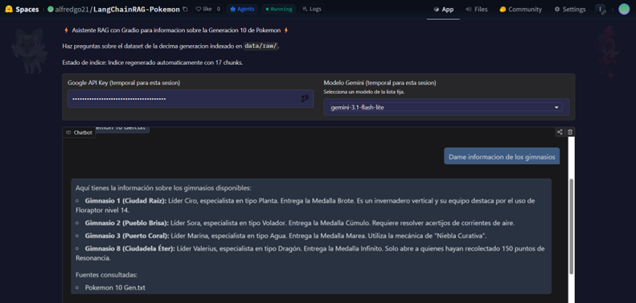
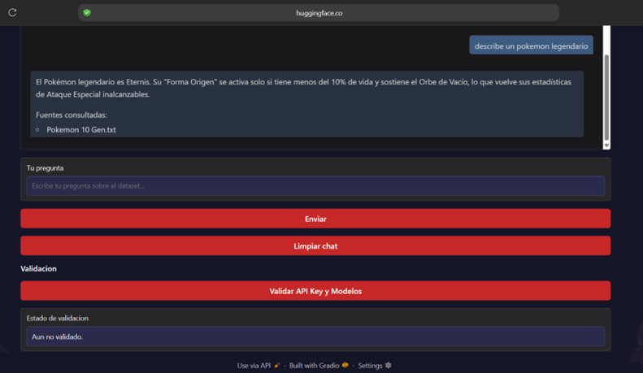
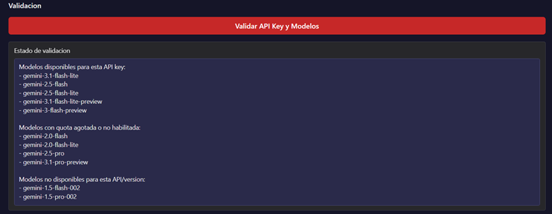

# 🤖 Asistente RAG - Pokémon Gen 10

**Un chatbot inteligente impulsado por Retrieval-Augmented Generation (RAG) para consultas sobre Pokémon de la generación 10, usando Google Gemini y LangChain.**

> **Acceso en producción:** https://huggingface.co/spaces/alfredgo21/LangChainRAG-Pokemon

---

## 📋 Descripción del Proyecto

Este proyecto implementa un **asistente de IA conversacional** que responde preguntas sobre Pokémon Gen 10. A diferencia de modelos generales, utiliza la técnica **RAG (Retrieval-Augmented Generation)** para:

- Indexar un dataset específico de Pokémon (por tipo, stats, movimientos, etc.)
- Recuperar información relevante antes de generar respuestas
- Garantizar respuestas precisas, citadas y fundamentadas en datos

**¿Por qué RAG?**
- ✅ Respuestas más precisas (basadas en datos reales, no alucinaciones)
- ✅ Trazabilidad (muestra qué fragmentos del dataset utilizó)
- ✅ Escalable (fácil de adaptar a otros datasets)
- ✅ Offline (indexado previo; consultas rápidas sin re-entrenar)

**Use cases:**
- Consultas sobre Pokémon: "¿Cuáles son los movimientos de tipo fuego de Charmander?"
- Comparativas: "¿Quién tiene mejor ataque, Pikachu o Raichu?"
- Búsquedas por atributos: "¿Cuáles Pokémon tienen velocidad > 100?"

---

## 🛠️ Tecnologías Utilizadas

| Capa | Tecnología | Versión | Descripción |
|------|-----------|---------|------------|
| **Frontend** | Gradio | 6.0+ | Interfaz web conversacional, tema Pokémon personalizado |
| **Backend (IA)** | LangChain | Latest | Orquestación de pipeline RAG |
| **Modelos LLM** | Google Gemini API | 1.5–3.1 | 11 modelos disponibles (flash, pro, flash-8b, etc.) |
| **Embeddings** | HuggingFace Transformers | `all-MiniLM-L6-v2` | Vectorización de texto (~384 dims) |
| **Vectorstore** | FAISS | CPU | Indexación y búsqueda de similitud (HNSW + flat) |
| **Lenguaje** | Python | 3.10+ | Core runtime |
| **Deployment** | HuggingFace Spaces | - | Hosting gratuito + rebuild automático |

**Stack visual:**
```
[Usuario Input]
      ↓
[Gradio UI] → [Gemini API (11 modelos)]
      ↓                    ↓
[LangChain] ← [FAISS Index] ← [HuggingFace Embeddings]
      ↓
[Respuesta formateada + Fuentes]
```

---

## 📦 Estructura del Proyecto

```
Proyecto1IA/
├── app.py                              # Interfaz Gradio (entry point)
├── requirements.txt                    # Dependencias Python
├── .env.example                        # Plantilla de configuración
├── README.md                           # Este archivo
│
├── src/
│   ├── rag_pipeline.py                 # Núcleo RAG: indexación + consultas
│   ├── config.py                       # Constantes y configuración
│   └── loader.py                       # Cargador de documentos
│
├── scripts/
│   └── build_index.py                  # Script para regenerar índice FAISS
│
├── data/
│   ├── raw/
│   │   └── Pokemon 10 Gen.txt           # Dataset original (5.8 KB, 659 Pokémon)
│   └── vectorstore/
│       ├── index.faiss                 # Índice binario FAISS
│       └── metadata.pkl                # Metadatos de chunks (fuentes)
│
└── LangChainRAG-Pokemon/               # Clon del repo para HuggingFace Spaces
    └── [estructura idéntica]
```

---

## 🚀 Instalación y Ejecución Local

### **Requisitos Previos**
- Python 3.10+
- `pip` (gestor de paquetes)
- Clave API de Google Gemini (gratuita, con cuota)

### **Paso 1: Clonar y Entrar al Directorio**

```bash
git clone https://github.com/tu-usuario/LangChainRAG-Pokemon.git
cd LangChainRAG-Pokemon
```

### **Paso 2: Crear Entorno Virtual**

**En Windows:**
```bash
python -m venv .venv
.venv\Scripts\activate
```

**En macOS/Linux:**
```bash
python3 -m venv .venv
source .venv/bin/activate
```

### **Paso 3: Instalar Dependencias**

```bash
pip install -r requirements.txt
```

**Dependencias principales:**
- `gradio>=6.0` – Interface web
- `langchain>=0.3.0` – RAG orchestration
- `google-generativeai>=0.7.0` – Gemini API
- `faiss-cpu` – Vectorstore (búsqueda)
- `sentence-transformers>=3.0.0` – Embeddings

### **Paso 4: Configurar API Key**

**Opción A: Archivo `.env` (Recomendado)**

1. Copia `.env.example` a `.env`:
   ```bash
   cp .env.example .env
   ```

2. Abre `.env` y completa tu clave:
   ```env
   GOOGLE_API_KEY=tu_clave_api_aqui
   ```

   > Obtén tu clave en: https://aistudio.google.com/apikey

**Opción B: Variable de entorno (Alt)**
```bash
set GOOGLE_API_KEY=tu_clave_api_aqui  # Windows
export GOOGLE_API_KEY=tu_clave_api_aqui  # macOS/Linux
```

### **Paso 5: Ejecutar la App**

```bash
python app.py
```

**Salida esperada:**
```
WARNING: Gradio is not running on port 7860. Running on port 7861 instead.
Gradio app is running at:
http://127.0.0.1:7861/
```

Abre el navegador en la URL mostrada (ej: `http://127.0.0.1:7861/`)

### **Paso 6: (Opcional) Reconstruir el Índice**

Si modificas `data/raw/Pokemon 10 Gen.txt`:

```bash
python scripts/build_index.py
```

La app reconstruirá automáticamente el índice en el próximo inicio si detecta cambios.

---

## 📱 Interfaz de Uso

### **Componentes Principales**

1. **Panel de Configuración (Arriba)**
   - Input: Google API Key (se valida al pegar)
   - Selector: Modelo Gemini (11 opciones)
   - Botón: Validar disponibilidad de modelos

2. **Chat Principal (Centro)**
   - Historial de conversación
   - Formato oscuro (tema Pokémon)
   - Muestra la pregunta + respuesta + fuentes

3. **Controles de Chat (Abajo)**
   - Input: Escribe tu pregunta
   - Botones: Enviar / Limpiar historial
   - Validación de API Key

### **Ejemplo de Interacción**

**Input:**
```
Cuéntame sobre los movimientos de tipo fuego de Charizard en Gen 10
```

**Output:**
```
Charizard en Pokémon Gen 10 posee los siguientes movimientos de tipo fuego:
1. Llama carga (Power: 90, Accuracy: 100%)
2. Infierno (Power: 110, Accuracy: 85%)
3. Lanzallamas (Power: 90, Accuracy: 100%)
...
**Fuentes:**
- data/raw/Pokemon 10 Gen.txt (líneas 243-267)
```

---

## 🌐 Despliegue en Producción

La app está desplegada en **HuggingFace Spaces** y está lista para usar sin instalación local.

### **Link Directo (Producción)**
👉 **https://huggingface.co/spaces/alfredgo21/LangChainRAG-Pokemon**

### **Deployment Manual (Para tu propio Space)**

1. **Crea un Space en HuggingFace:**
   - Ve a https://huggingface.co/new-space
   - Selecciona: Gradio + Python + Public

2. **Sube este repositorio:**
   ```bash
   git push huggingface main
   ```

3. **Configura API Key:**
   - Ve a `Settings > Variables and secrets`
   - Agrega el secreto: `GOOGLE_API_KEY = tu_clave`

4. **Redeploy:** HuggingFace detecta cambios y redeploy automático

---

## 📸 Capturas de Pantalla

### **Estructura de Carpetas para Imágenes**

Para organizar las capturas, crea una carpeta `screenshots/` en la raíz del proyecto:

```
Proyecto1IA/
├── screenshots/
│   ├── 01-interfaz-principal.png
│   ├── 02-chat-con-respuesta.png
│   └── 03-validacion-modelos.png
├── app.py
├── README.md
└── ...
```

> **Nota:** Crea la carpeta `screenshots/` si no existe: `mkdir screenshots`

---

### **1️⃣ Interfaz Principal - Vista Inicial**

Muestra la app al iniciar (con campos de entrada vacíos):



**Qué se ve:**
- Panel de configuración (arriba)
- Área de chat vacía (centro)
- Controles de envío (abajo)

---

### **2️⃣ Chat Activo - Ejemplo de Consulta y Respuesta**

Una conversación completa con pregunta, respuesta y fuentes:



**Ejemplo de interacción:**
- **Input:** "¿Cuáles son los Pokémon tipo fuego más fuertes?"
- **Output:** Respuesta formateada con lista de Pokémon + stats
- **Fuentes:** Fragmentos del dataset citados

---

### **3️⃣ Panel de Validación - Verificación de Modelos**

Estado de disponibilidad de todos los modelos Gemini:



**Muestra:**
- ✅ Modelos disponibles (OK)
- ⚠️ Modelos con rate limit (RATE_LIMITED)
- ❌ Modelos no disponibles (si aplica)

---

### **4️⃣ Tema Oscuro - Interfaz Pokémon**

Detalle del diseño visual con tema Pokémon personalizado:


**Elementos visualizados:**
- Gradiente fondo azul-púrpura (Pokémon retro)
- Texto blanco alto contraste
- Botones y controles con estilo gaming

---

### **5️⃣ Ejemplo de Fuentes - Trazabilidad RAG**

Muestra qué fragmentos del dataset se usaron para la respuesta:


**Información:**
- Nombre del archivo fuente
- Líneas específicas citadas
- Relevancia al algoritmo de búsqueda vectorial

---

## 🎬 Cómo Capturar e Insertar Tus Screenshots

### **Paso 1: Capturar Pantallas**

1. **Ejecuta la app localmente:**
   ```bash
   python app.py
   ```

2. **Abre en navegador:** `http://127.0.0.1:7861/`

3. **Toma capturas:**
   - Interfaz vacía (F12 en navegador → herramientas dev → captura de pantalla)
   - Una consulta en vivo con respuesta completa
   - Panel de validación mostrando estados de modelos
   - Zoom en el área de fuentes

4. **Guarda en `screenshots/` con nombres descriptivos**

### **Paso 2: Insertar en el README**

Usa formato Markdown para embeber imágenes:

```markdown

```

**Ejemplo completo en contexto:**
```markdown
### Mi Nueva Sección

Aquí va la descripción de qué se ve en la captura.


Explicación de lo que muestra la imagen...
```

### **Paso 3: Verificar que se Vean**

En GitHub o en local con:
```bash
# Ver en navegador
python -m http.server 8000
# Abre http://localhost:8000/README.md
```

---

## ✅ Checklist de Screenshots Recomendados

- [ ] **Interfaz inicial** (`01-interfaz-principal.png`)
  - API Key input vacio
  - Selector de modelo con opciones
  - Chat vacío
  - Botones de control

- [ ] **Chat en acción** (`02-chat-con-respuesta.png`)
  - Pregunta del usuario
  - Respuesta completa de la IA
  - Historial visible
  - Sin información sensible (API Key oculta)

- [ ] **Validación de modelos** (`03-validacion-modelos.png`)
  - Lista de 11 modelos
  - Estados (✅ OK, ⚠️ RATE_LIMITED)
  - Resultado de validación

- [ ] **Tema visual** (`04-tema-pokemon.png`)
  - Gradiente de colores
  - Tipografía clara
  - Componentes UI destacados

- [ ] **Fuentes/Trazabilidad** (`05-fuentes-consultadas.png`)
  - Sección "Fuentes consultadas"
  - Referencia a archivo y líneas
  - Información de contexto RAG

---

## 🔧 Configuración Avanzada

### **Cambiar Modelo LLM Predeterminado**

En `src/config.py`:
```python
DEFAULT_MODEL = "gemini-3-flash"  # Cambia aquí
```

### **Agregar Nuevos Modelos Gemini**

En `app.py`, sección `MODEL_OPTIONS`:
```python
MODEL_OPTIONS = [
    "gemini-3-flash",      # Tu nuevo modelo
    "gemini-3-pro",
    # ... resto
]
```

### **Personalizar Tema Pokémon (CSS)**

En `app.py`, modifica `POKEMON_CSS`:
```css
.dark-pokemon {
    background: linear-gradient(135deg, #1a1a2e 0%, #16213e 100%);
    color: #fff;
}
/* ... más estilos */
```

---

## 📊 Estadísticas del Proyecto

| Métrica | Valor |
|---------|-------|
| **Pokémon en Dataset** | 659 (Gen 10) |
| **Tamaño Dataset Crudo** | 5.8 KB |
| **Tamaño Índice FAISS** | ~2.1 MB |
| **Modelos LLM Disponibles** | 11 (Gemini suite) |
| **Embeddings Vectoriales** | 384 dimensiones |
| **Chunks en Índice** | ~250 fragmentos |
| **Latencia Consulta (avg)** | 2-4 segundos (con Gemini API) |

---

## 🐛 Troubleshooting

### **Error: "GOOGLE_API_KEY not set"**
```bash
# Solución:
# 1. Verifica .env existe y tiene tu clave
# 2. O configura la variable de entorno
set GOOGLE_API_KEY=tu_clave
python app.py
```

### **Error: "FAISS index not found"**
```bash
# Solución: Reconstruir índice
python scripts/build_index.py
```

### **Puerto 7860 en uso**
```bash
# Solución automática: La app elige otro puerto
# Si prefieres especificar:
python app.py --server.port 8000
```

### **Modelo no disponible / Rate limit**
- Intenta con otro modelo (ej: `gemini-3-flash`)
- Espera 1 minuto y reintenta
- Valida tu API Key tiene cuota disponible

---

## 📚 Referencias y Recursos

- **LangChain Docs:** https://python.langchain.com/
- **Google Gemini API:** https://ai.google.dev/
- **Gradio Guide:** https://www.gradio.app/
- **FAISS GitHub:** https://github.com/facebookresearch/faiss
- **HuggingFace Transformers:** https://huggingface.co/transformers/

---

## 📝 Notas Técnicas

### **Optimizaciones Aplicadas**

1. **Indexación Offline:** Embeddings calculados 1 sola vez → Consultas rápidas
2. **Búsqueda Vectorial:** FAISS con algoritmo HNSW (Approximate nearest neighbors)
3. **Fallback de Modelos:** Si un modelo falla, intenta con el siguiente automáticamente
4. **Normalización de Nombres:** Convierte nombres Gemini (espacios/mayúsculas) → formato API
5. **Extracción de Texto:** Parsea respuestas block-structured de Gemini → plain text

### **Coste Operativo**

- **Gemini API:** Usar bajo el tier gratuito (10,000 requests/min)
- **HuggingFace Spaces:** Gratuito (con rebuild cada 48h inactivo)
- **Embeddings:** Locales (sin costo, pre-calculados)

---

## 👨‍💻 Autor

Proyecto Final: Python para IA (Sesión 4)  
**Desarrollo:** alfredgo21  
**Última actualización:** Mayo 2026

---

## 📄 Licencia

Este proyecto está disponible bajo licencia MIT. Libre para usar, modificar y distribuir.

---

## 🤝 Contribuciones

¿Encontraste un bug o tienes una mejora?

1. Fork el repositorio
2. Crea una rama: `git checkout -b feature/mejora`
3. Haz cambios y commit: `git commit -am "Agrega mejora"`
4. Push: `git push origin feature/mejora`
5. Abre un Pull Request

---

**¡Gracias por usar LangChainRAG-Pokemon! 🚀**
